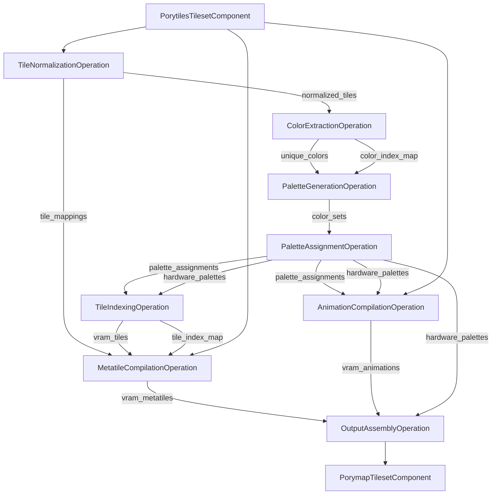
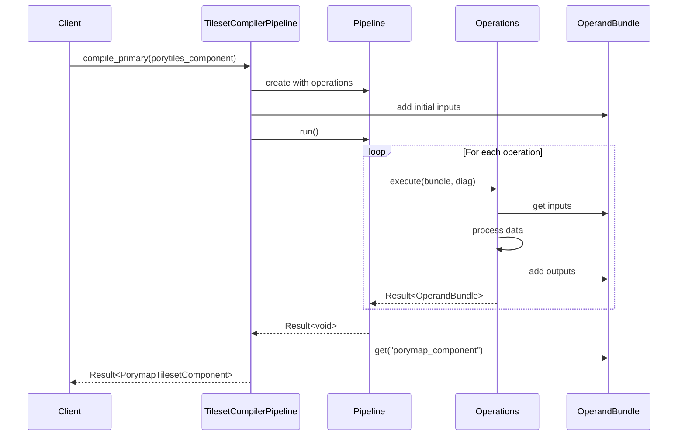

# Compile Primary Tileset

## Color Handling
Porytiles2 will use full RGBA all the way through.
We have to do this to support complete symmetric import/compilation,
since vanilla tilesets use 8-bit colors in their pals.

## Normalization
Now handling normalization with our new PixelTile/ShapeTile distinction.
CanonicalShapeTile can easily detect flip and color isomorphisms
in a single representation.

## Tile Workspace
`tiles.png` can be represented by a TileWorkspace,
which is basically a searchable collection of canonical tiles.
For the patch compilation case,
we can prefill the workspace with the existing tiles.
That way, when we get to the tile assignment step,
we can just look up the tile in the workspace.
We will of course need to calculate the correct flip bits for the final TilemapEntry.

Tile workspace can be a collection of CanonicalPixelTile<IndexPixel>

## Example Mermaid Diagrams

### Example Data Flow Diagram



### Example Pipeline Execution Flow



### Compile Primary (Using New CanonicalShapeTile)

Convert layer images into `vector<RgbaMetatile>`

Leaf step to throw error if there are too many metatiles.

Decompose `vector<RgbaMetatile>` into `vector<RgbaTile>` (we have a compute_metatile function which allows us to reconstruct the original metatile params from a raw tile index)
 
Leaf step to throw errors if:
- any tiles contain an invalid alpha value
- any tiles have more than 15+1 colors
- generate precision loss warnings if some colors collapse to the same 5-bit color

Create color index map from `vector<RgbaTile>`

Generate `vector<CanonicalShapeTile<ColorIndex>>` using color index map and `vector<RgbaTile>`

Create `vector<PackSet>` for VM packing (definition TBD)

Optional: via `vector<CanonicalShapeTile>` compute color isomorphism cliques to pass to VM packer

Create `vector<PackBin>` to pass to VM packer (`PackBin` is the hardware pal type?)

Run VM packing

Convert `vector<PackBin>` to `vector<Palette<Rgba32>>`

Convert `vector<CanonicalShapeTile<ColorIndex>>` -> `vector<CanonicalShapeTile<Rgba32>>`

Use each elem of `vector<CanonicalShapeTile<Rgba32>>` plus `vector<Palette<Rgba32>>` to create `vector<CanonicalPixelTile<IndexPixel>>`

Init blank TileWorkspace, add in override tiles from `porytiles/tiles_override.png`

Use the `vector<CanonicalPixelTile<IndexPixel>>` and `vector<PackSet>` to fill up TileWorkspace and generate TilemapEntries

We have three parallel tile vectors, each entry aligned to correspond to the same tile:
- vector<RgbaTile>: the original PixelTile with color data
- vector<CanonicalShapeTile>: the canonicalized ShapeTile version of the tile, mapped to ColorIndex
- vector<PackSet>: this tile's PackSet, which stores the tile ColorSet and final pal assignment

### Compile Primary Patch -- Tiles And Pals Fixed
```c++
// This is a rough outline, consider it pseudocode.
// This is the flow for a patch build when both tiles and pals are fixed.
// This type of build is very simple.
ChainableResult<std::unique_ptr<Tileset>> PrimaryTilesetCompiler::compile_patch(const Tileset &tileset)
{
    // Read Porytiles layer images and decompose into tile vector
    std::vector<Metatile<Rgba32>> porytiles_metatiles =
            metatileizer.metatileize(tileset.porytiles_component().bottom(), tileset.porytiles_component().middle(), tileset.porytiles_component().top());
    if (porytiles_metatiles.size() > config_->num_metatiles_primary()) {
        return FormattableError{"too many input metatiles in porytiles component"};
    }
    std::vector<PixelTile<Rgba32>> porytiles_tiles = metatile::decompose(porytiles_metatiles);
    std::vector<CanonicalPixelTile<Rgba32>> canonical_porytiles_tiles = map<CanonicalPixelTile<Rgba32>>(porytiles_tiles);

    // Decompile Porymap tilemap entries and decompose into tile vector
    auto tilemap_entries = layer_mode_converter.triple_layerize(tileset.porymap_component().metatiles_bin());
    std::vector<Metatile<Rgba32>> porymap_metatiles =
            metatile_decompiler.decompile(tilemap_entries, tileset.porymap_component().tiles_png(), tileset.porymap_component().pals());
    // We don't need to check porymap_metatiles size here. We're going to overwrite it anyway.
    // We only need to check the size of the final tilemap entry vector.
    // Patch builds don't need to preserve tilemap entries since those cannot be referenced by other tilesets.
    std::vector<PixelTile<Rgba32>> porymap_tiles = metatile::decompose(porymap_metatiles);
    std::vector<CanonicalPixelTile<Rgba32>> canonical_porymap_tiles = map<CanonicalPixelTile<Rgba32>>(porymap_tiles);

    // Leaf steps to catch too many colors, bad alpha, warn about precision loss
    PT_TRY_CALL_CHAIN_ERR(validator.validate_alpha_channels(tiles), "tile validation error", std::unique_ptr<Tileset>);
    PT_TRY_CALL_CHAIN_ERR(
        validator.validate_unique_color_count(tiles, extrinsic_transparency_config.value()),
        "tile validation error",
        std::unique_ptr<Tileset>);
    PT_TRY_CALL_CHAIN_ERR(
        validator.generate_precision_loss_warnings(tiles), "tile validation error", std::unique_ptr<Tileset>);

    // Create ColorIndexMap from porytiles_tiles
    // We don't actually need a ColorIndexMap for a pals:fixed patch build
    // However, we build one so that we can throw if the user specified too many unique colors in the input
    // TODO: do we care? In a completely fixed build, if the user does specify too many unique colors, it is guaranteed
    // to fail at a later step which may be more descriptive for the user. Perhaps we can keep this here and just emit
    // a regular error and let compilation continue?
    ColorIndexMap color_index_map{porytiles_tiles, extrinsic_transparency.value()};
    if (color_index_map.size() > num_colors_primary) {
        return FormattableError{"too many unique colors in porytiles component"};
    }

    // Generate `vector<CanonicalShapeTile<ColorIndex>>` using color index map and `vector<RgbaTile> porytiles`

    // Convert `vector<CanonicalShapeTile<ColorIndex>>` -> `vector<CanonicalShapeTile<Rgba32>>`

    // Init a `vector<size_t> pal_indexes`.
    // Use each elem of `vector<CanonicalShapeTile<Rgba32>>` plus Porymap `vector<Palette<Rgba32>>` to create `vector<CanonicalPixelTile<IndexPixel>>`
    // Note: we need to make sure to only check the pals relevant to the tileset, i.e. if this is primary, don't check pals 7-15.
    // If no pal matches, emit an error and continue until the end of the vector.
    // Otherwise, push back the matching pal index to `pal_indexes`.

    // Init blank TileWorkspace, add in override tiles from Porymap `tiles.png` (warn that `porytiles/tiles_override.png` will be ignored)

    // Iterate over `vector<CanonicalPixelTile<IndexPixel>>` and both `vector<PixelTile<Rgba32>>`.
    // If current `porytiles PixelTile<Rgba32>` equals the `porymap PixelTile<Rgba32>`, then we don't need to compute anything, it's unchanged.
    // Just grab the original tilemap entry and re-emit.
    // Note: it's possible the `porytiles PixelTile<Rgba32>` and `porymap PixelTile<Rgba32>` might have different transparencies.
    // E.g. the porytiles one might be using alpha channel,
    // while the porymap one will be using the extrinsic transparency color (see MetatileDecompiler).
    // So we need to check equality while ignoring different representations of transparent pixels.
    // Also check current `porytiles CanonicalPixelTile<Rgba32>`

    // If the tiles differ, then we have a genuine update.
    // Find the current `CanonicalPixelTile<IndexPixel>` in the TileWorkspace.
    // If it doesn't exist, emit an error and continue until the end of the vector.
    // Otherwise, check the corresponding pal index in `pal_indexes`.
    // We now have the tile index, pal index, and flip bits. Emit a tilemap entry.
}
```
