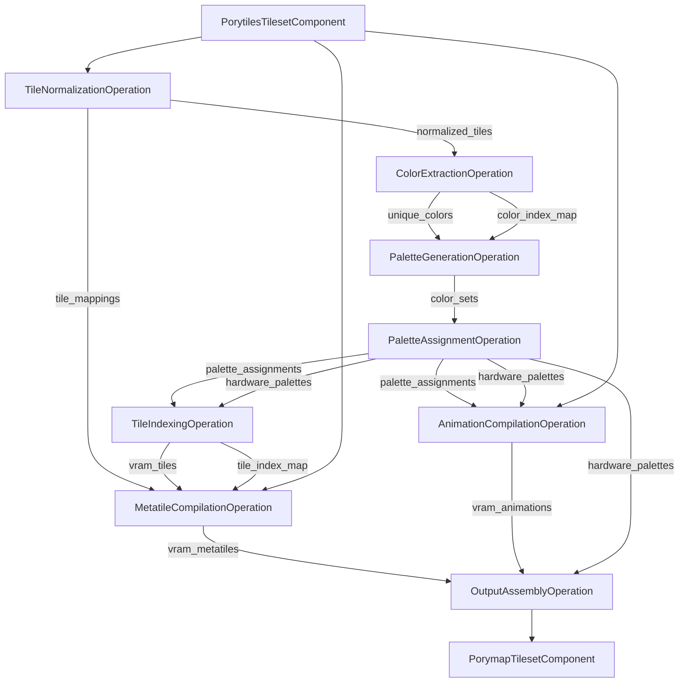
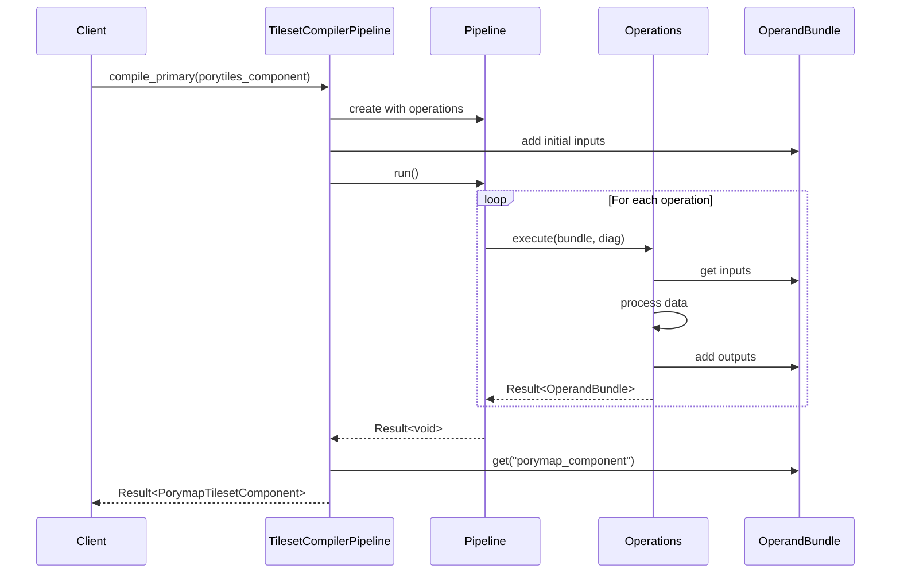

# Compile Primary Tileset

## Color Handling
Porytiles2 will use full RGBA all the way through.
We have to do this to support complete symmetric import/compilation,
since vanilla tilesets use 8-bit colors in their pals.

## Normalization
Implement normalization solution outlined here: https://github.com/grunt-lucas/porytiles/issues/118
This normalization that includes the palette will be called full normalization.
Alternatively, we can provide the normalization of Porytiles1 called "partial normalization".
We'll want both, because for incremental compilation,
we need to be able to detect when a sibling is in use.
And for that, we'll need partial normalization as well.
Let's think about this more.

## Tile Workspace
`tiles.png` can be represented by a TileWorkspace,
which is basically a searchable collection of NormalizedTiles.
For the incremental compilation case,
we can prefill the workspace with the existing tiles.
That way, when we get to the tile assignment step,
we can just look up the tile in the workspace.
We will of course need to calculate the correct flip bits for the final TilemapEntry.

## Example Mermaid Diagrams

### Data Flow Diagram

### Pipeline Execution Flow

