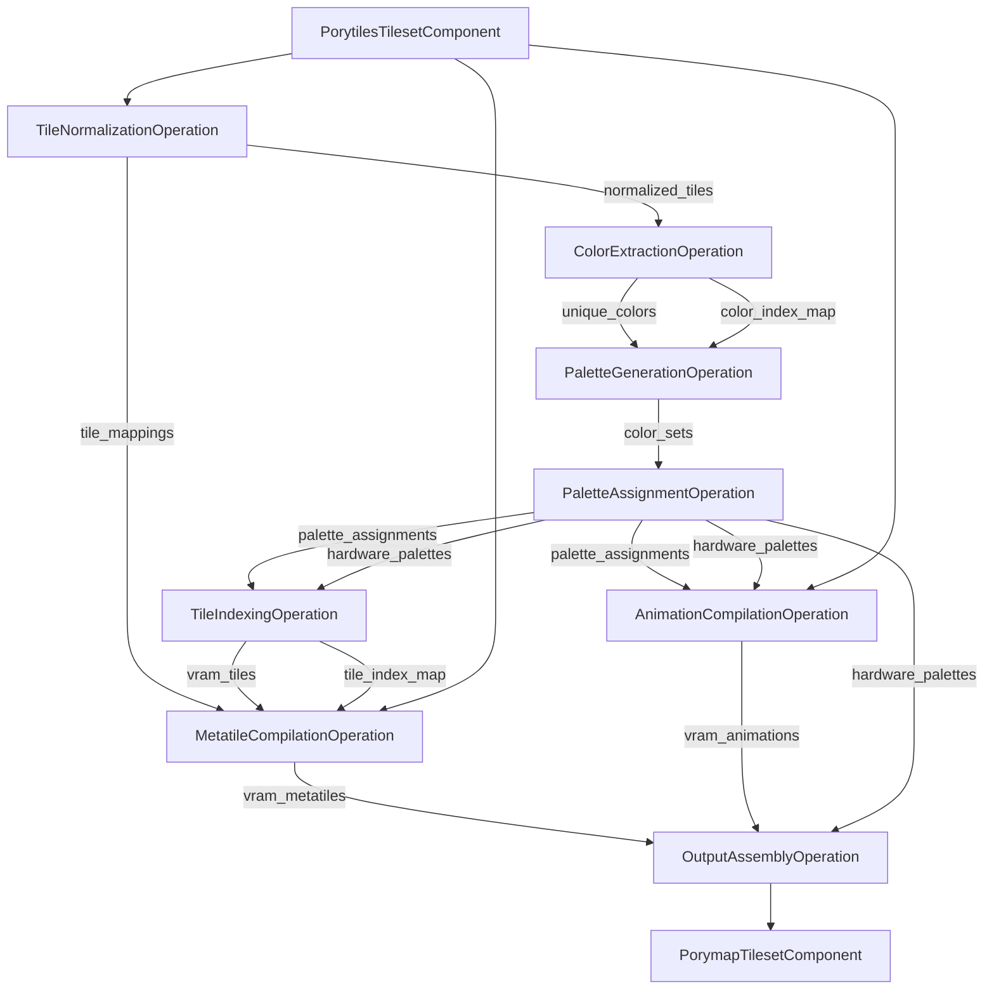
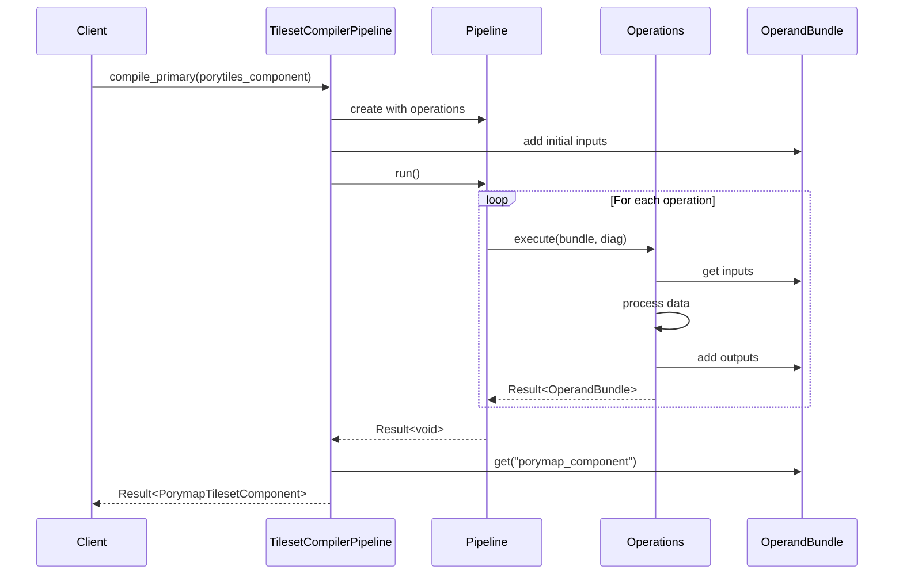

# Compile Primary Tileset Implementation Plan

## Overview

This document outlines the implementation plan for the "Compile Primary Tileset" use case in Porytiles2. The compilation process transforms human-friendly RGBA assets (PorytilesTilesetComponent) into GBA-ready binary assets (PorymapTilesetComponent) using a pipeline-based architecture.

## Architecture Design

### Core Components

1. **TilesetCompilerPipeline** (implements TilesetCompiler interface)
   - Location: `include/porytiles2/infra/services/tileset_compiler_pipeline.hpp`
   - Constructs and executes the compilation pipeline
   - Manages operation dependencies and data flow

2. **Operation Classes** (implement Operation interface)
   - Location: `include/porytiles2/infra/orchestration/operations/`
   - Each operation represents a distinct compilation stage
   - Operations communicate via OperandBundle

### Directory Structure

```
Porytiles2/
├── include/porytiles2/
│   └── infra/
│       ├── orchestration/
│       │   └── operations/
│       │       ├── tile_normalization_operation.hpp
│       │       ├── color_extraction_operation.hpp
│       │       ├── palette_generation_operation.hpp
│       │       ├── palette_assignment_operation.hpp
│       │       ├── tile_indexing_operation.hpp
│       │       ├── animation_compilation_operation.hpp
│       │       ├── metatile_compilation_operation.hpp
│       │       └── output_assembly_operation.hpp
│       └── services/
│           └── tileset_compiler_pipeline.hpp
└── lib/
    └── infra/
        ├── orchestration/
        │   └── operations/
        │       └── [corresponding .cpp files]
        └── services/
            └── tileset_compiler_pipeline.cpp
```

## Operation Classes Breakdown

### 1. TileNormalizationOperation
**Purpose**: Convert RgbaTiles to a normalized format, handling transparency and flip detection
- **Inputs**: `porytiles_component` (PorytilesTilesetComponent)
- **Outputs**: `normalized_tiles` (vector of NormalizedTile), `tile_mappings` (flip/orientation data)
- **Responsibilities**:
  - Extract unique tiles from metatiles
  - Detect optimal flip configurations
  - Handle transparency color conversion
  - Create tile deduplication mappings

### 2. ColorExtractionOperation
**Purpose**: Extract unique BGR15 colors from all tiles
- **Inputs**: `normalized_tiles`
- **Outputs**: `unique_colors` (set of Bgr15), `color_index_map` (Bgr15 → index mapping)
- **Responsibilities**:
  - Convert RGBA colors to BGR15
  - Build color-to-index mappings
  - Track color usage statistics

### 3. PaletteGenerationOperation
**Purpose**: Generate color sets representing palette requirements for each tile
- **Inputs**: `normalized_tiles`, `color_index_map`
- **Outputs**: `color_sets` (vector of bitsets representing which colors each tile uses)
- **Responsibilities**:
  - Create bitsets for each tile's color usage
  - Deduplicate color sets
  - Prepare data for palette assignment

### 4. PaletteAssignmentOperation
**Purpose**: Assign tiles to hardware palettes using BFS algorithm
- **Inputs**: `color_sets`, `unique_colors`
- **Outputs**: `palette_assignments` (tile → palette mapping), `hardware_palettes` (vector of BgrPal)
- **Responsibilities**:
  - Run palette assignment algorithm
  - Handle palette count constraints
  - Optimize palette usage

### 5. TileIndexingOperation
**Purpose**: Create indexed VRAM tiles from normalized tiles using assigned palettes
- **Inputs**: `normalized_tiles`, `palette_assignments`, `hardware_palettes`
- **Outputs**: `vram_tiles` (vector of VramTile), `tile_index_map` (normalized → vram index)
- **Responsibilities**:
  - Convert colors to palette indices
  - Handle tile deduplication
  - Manage tile ordering

### 6. AnimationCompilationOperation
**Purpose**: Compile RGBA animations to VRAM format
- **Inputs**: `porytiles_component`, `palette_assignments`, `hardware_palettes`
- **Outputs**: `vram_animations` (vector of VramAnim)
- **Responsibilities**:
  - Process animation frames
  - Link animations to base tiles
  - Generate frame data

### 7. MetatileCompilationOperation
**Purpose**: Assemble VramMetatiles from individual tiles
- **Inputs**: `porytiles_component`, `vram_tiles`, `tile_index_map`, `tile_mappings`
- **Outputs**: `vram_metatiles` (vector of VramMetatile)
- **Responsibilities**:
  - Map RGBA metatiles to VRAM tiles
  - Apply flip/mirror transformations
  - Handle layering (bottom/middle/top)

### 8. OutputAssemblyOperation
**Purpose**: Assemble final PorymapTilesetComponent
- **Inputs**: `vram_metatiles`, `vram_animations`, `hardware_palettes`
- **Outputs**: `porymap_component` (PorymapTilesetComponent)
- **Responsibilities**:
  - Create final component structure
  - Apply padding if necessary
  - Generate metadata

## Data Flow Diagram



## Pipeline Execution Flow



## Implementation Considerations

### Error Handling
- Each operation returns `Result<OperandBundle>` for error propagation
- Use DiagnosticEngine for detailed error reporting
- Validate inputs at each stage
- Provide meaningful error messages with context

### Performance
- Use move semantics where possible to avoid copies
- Consider parallel execution for independent operations
- Cache intermediate results when beneficial
- Profile bottleneck operations (palette assignment, tile deduplication)

### Testing Strategy
- Unit test each operation independently
- Create mock data for operation inputs/outputs
- Integration test the full pipeline
- Test edge cases (empty tilesets, maximum tiles, etc.)

### Configuration
- Support compilation options via TilesetCompilerConfig
- Allow customization of:
  - Transparency color
  - Palette count limits
  - Tile deduplication settings
  - Animation handling

### Future Extensions
- Support for incremental compilation
- Palette override mechanisms
- Custom operation injection points
- Performance metrics collection

## Class Interface Examples

### TilesetCompilerPipeline
```cpp
class TilesetCompilerPipeline : public TilesetCompiler {
public:
    explicit TilesetCompilerPipeline(std::shared_ptr<DiagnosticEngine> diag);
    
    Result<std::unique_ptr<PorymapTilesetComponent>>
    compile_primary(const PorytilesTilesetComponent &tileset) override;
    
private:
    std::shared_ptr<DiagnosticEngine> diag_;
    
    std::vector<std::shared_ptr<Operation>> build_primary_pipeline();
};
```

### Example Operation Interface
```cpp
class TileNormalizationOperation : public Operation {
public:
    explicit TileNormalizationOperation(const CompilerConfig &config);
    
    std::vector<OperandDeclaration> inputs() const override;
    std::vector<OperandDeclaration> outputs() const override;
    
    Result<OperandBundle> execute(const OperandBundle &inputs,
                                  DiagnosticEngine &diag) const override;
    
private:
    CompilerConfig config_;
};
```

## Next Steps

1. Implement base operation classes with common functionality
2. Create unit tests for each operation
3. Implement TilesetCompilerPipeline
4. Integration test with sample tilesets
5. Performance profiling and optimization
6. Documentation and usage examples