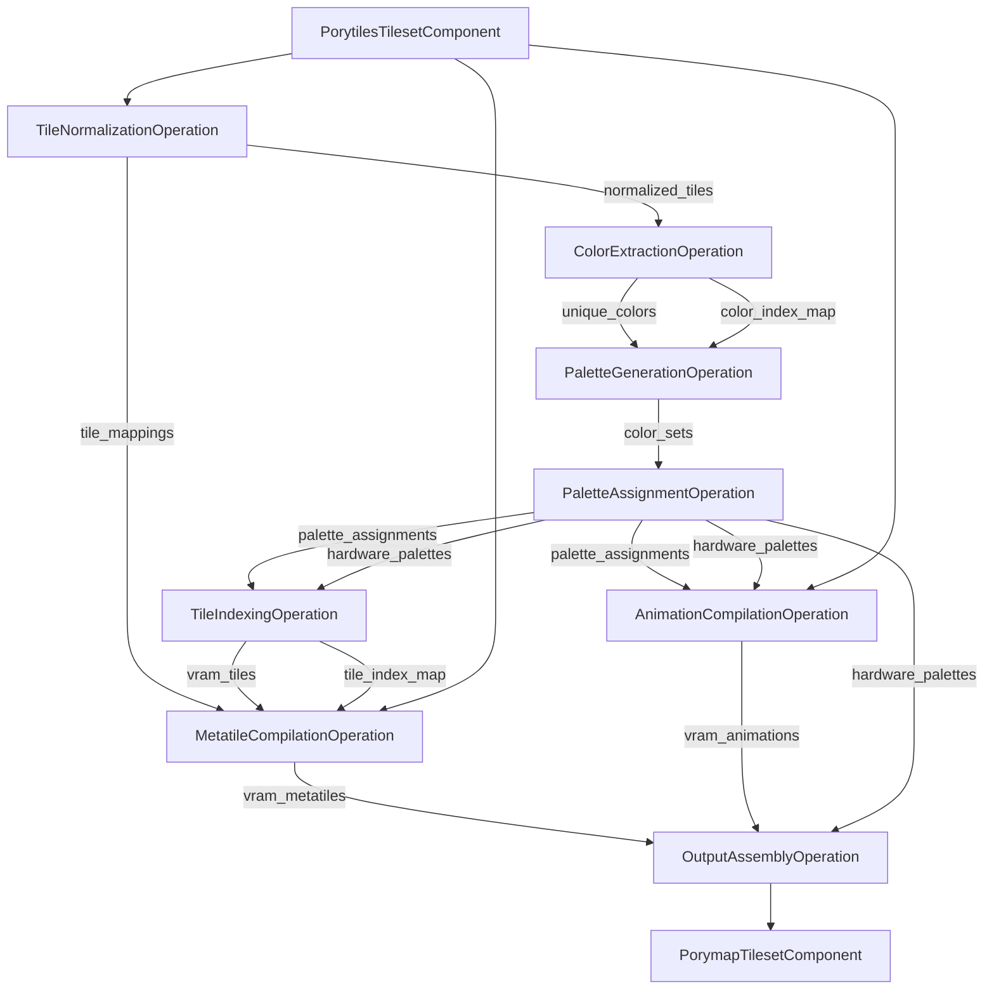
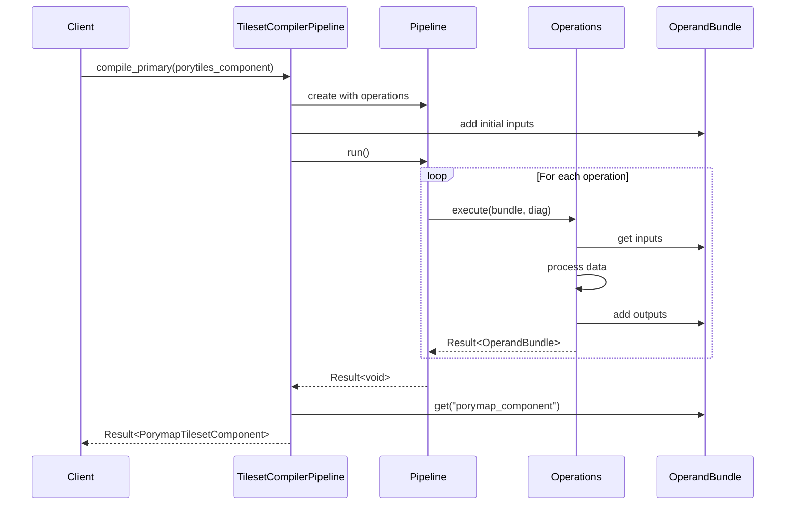

# Compile Primary Tileset

## Color Handling
Porytiles2 will use full RGBA all the way through.
We have to do this to support complete symmetric import/compilation,
since vanilla tilesets use 8-bit colors in their pals.

## Normalization
Now handling normalization with our new PixelTile/ShapeTile distinction.
CanonicalShapeTile can easily detect flip and color isomorphisms
in a single representation.

## Tile Workspace
`tiles.png` can be represented by a TileWorkspace,
which is basically a searchable collection of canonical tiles.
For the incremental compilation case,
we can prefill the workspace with the existing tiles.
That way, when we get to the tile assignment step,
we can just look up the tile in the workspace.
We will of course need to calculate the correct flip bits for the final TilemapEntry.

Tile workspace can be a collection of CanonicalPixelTile<IndexPixel>

## Example Mermaid Diagrams

### Example Data Flow Diagram

### Example Pipeline Execution Flow

### Compile Primary (Using New CanonicalShapeTile)

Convert layer images into `vector<RgbaMetatile>`

Leaf step to throw error if there are too many metatiles.

Decompose `vector<RgbaMetatile>` into `vector<RgbaTile>` (we have a compute_metatile function which allows us to reconstruct the original metatile params from a raw tile index)
 
Leaf step to throw errors if:
- any tiles contain an invalid alpha value
- any tiles have more than 15+1 colors
- generate precision loss warnings if some colors collapse to the same 5-bit color

Create color index map from `vector<RgbaTile>`

Generate `vector<CanonicalShapeTile<ColorIndex>>` using color index map and `vector<RgbaTile>`

Create `vector<PackSet>` for VM packing (definition TBD)

Optional: via `vector<CanonicalShapeTile>` compute color isomorphism cliques to pass to VM packer

Create `vector<PackBin>` to pass to VM packer (`PackBin` is the hardware pal type?)

Run VM packing

Convert `vector<CanonicalShapeTile<ColorIndex>>` -> `vector<CanonicalShapeTile<Rgba32>>`

Use each elem of `vector<CanonicalShapeTile<Rgba32>>` plus `PackBin`s to create `vector<CanonicalPixelTile<IndexPixel>>`

Init blank TileWorkspace, add in override tiles from `porytiles/tiles_override.png`

Use the `vector<CanonicalPixelTile<IndexPixel>>` and `vector<PackSet>` to fill up TileWorkspace and generate TilemapEntries

We have three parallel tile vectors, each entry aligned to correspond to the same tile:
- vector<RgbaTile>: the original PixelTile with color data
- vector<CanonicalShapeTile>: the canonicalized ShapeTile version of the tile, mapped to ColorIndex
- vector<PackSet>: this tile's PackSet, which stores the tile ColorSet and final pal assignment

### Compile Primary Incremental
1. Convert layer images into vector<RgbaMetatile>
2. Leaf step to throw error if there are too many metatiles.
3. Decompose vector<RgbaMetatile> into vector<RgbaTile> (we have a compute_metatile function which allows us to reconstruct the original metatile params from a raw tile index)
4. Leaf step to throw errors if any tiles have more than 15+1 colors.
5. Leaf step to generate precision loss warnings if some colors collapse to the same 5-bit color.
6. Create color index map from vector<RgbaTile>
7. Generate vector<CanonicalShapeTile<ColorIndex>> using color index map and vector<RgbaTile>
8. Create `vector<PackSet>` for VM packing (definition TBD)
9. Optional: via `vector<CanonicalShapeTile>` compute color isomorphism cliques to pass to VM packer
10. Create `vector<PackBin>` to pass to VM packer (`PackBin` is the hardware pal type?), init PackBins with overrides from `palettes` folder
11. Run VM packing
12. Convert `vector<CanonicalShapeTile<ColorIndex>>` -> `vector<CanonicalShapeTile<Rgba32>>`
13. Use each elem of `vector<CanonicalShapeTile<Rgba32>>` plus `PackBin`s to create `vector<CanonicalPixelTile<IndexPixel>>`
14. Init blank TileWorkspace, add in override tiles from `tiles.png` (warn that `porytiles/tiles_override.png` will be ignored)
15. Use the `vector<CanonicalPixelTile<IndexPixel>>` and `vector<PackSet>` to fill up TileWorkspace and generate TilemapEntries
